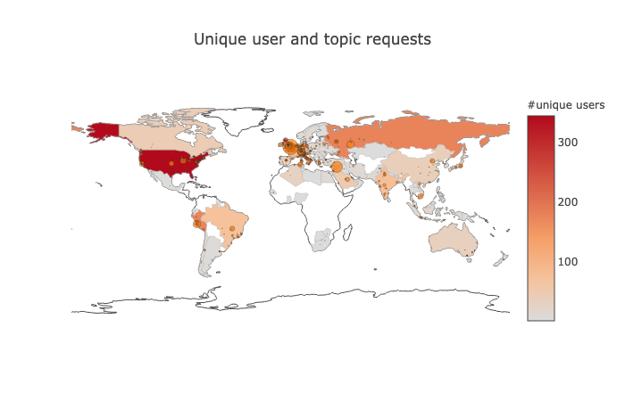

# The Computer Science Ontology: A Comprehensive Automatically-Generated Taxonomy of Research Areas

**Abstract.** Ontologies of research areas are important tools for characterising, exploring, and analysing the research landscape. Some fields of research are comprehensively described by large-scale taxonomies, e.g., MeSH in Biology and PhySH in Physics. Conversely, current Computer Science taxonomies are coarse-grained and tend to evolve slowly. For instance, the ACM classification scheme contains only about 2K research topics and the last version dates back to 2012. In this paper, we introduce the Computer Science Ontology (CSO), a large-scale, automatically generated ontology of research areas, which includes about 14K topics and 162K semantic relationships. It was created by applying the Klink-2 algorithm on a very large dataset of 16M scientific articles. CSO presents two main advantages over the alternatives: i) it includes a very large number of topics that do not appear in other classifications, and ii) it can be updated automatically by running Klink-2 on recent corpora of publications. CSO powers several tools adopted by the editorial team at Springer Nature and has been used to enable a variety of solutions, such as classifying research publications, detecting research communities, and predicting research trends. To facilitate the uptake of CSO, we have also released the CSO Classifier, a tool for automatically classifying research papers, and the CSO Portal, a web application that enables users to download, explore, and provide granular feedback on CSO. Users can use the portal to navigate and visualise sections of the ontology, rate topics and relationships, and suggest missing ones. The portal will support the publication of and access to regular new releases of CSO, with the aim of providing a comprehensive resource to the various research communities engaged with scholarly data. 

# CSO-stats-analytics
This repository contains a Python notebook (CSO Statistics.ipynb) which loads both topic and download requests of the CSO Portal up to the 8th of August and it produces some visualizations.

# Requirements

pandas and plotly